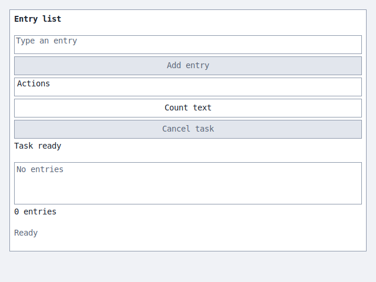
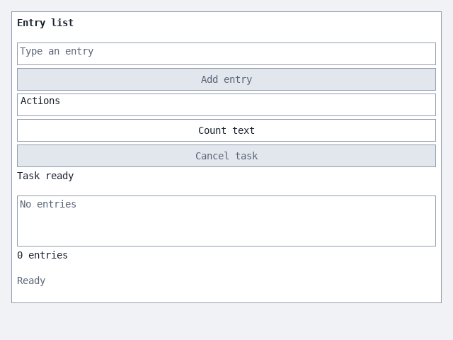
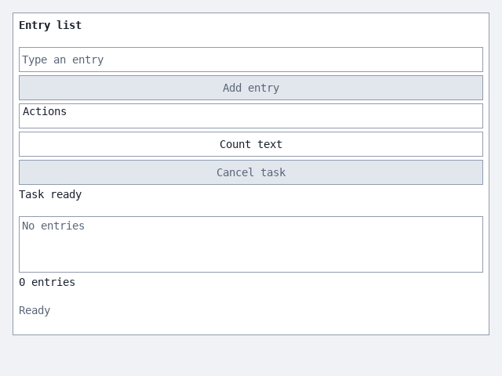
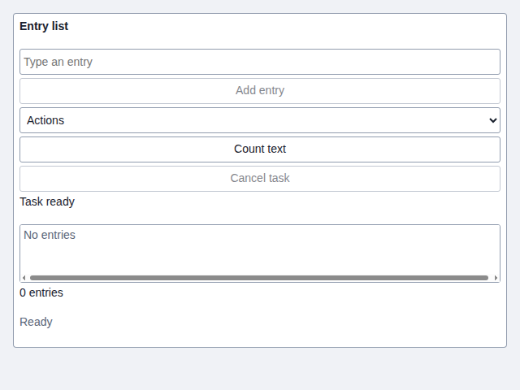
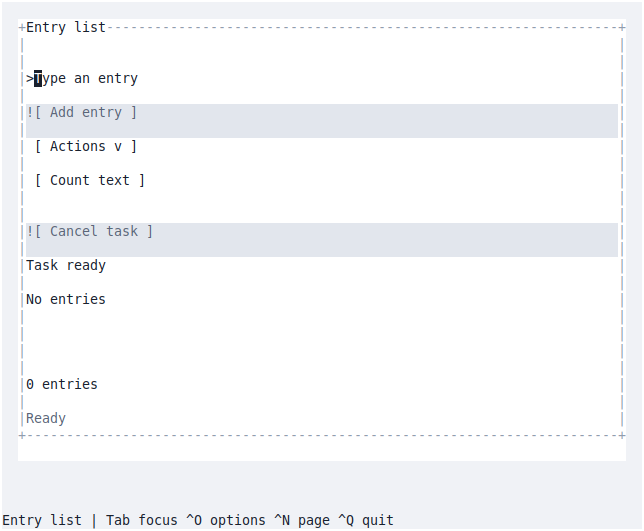

# Software Foundation

A generic reference repository for developing, testing, maintaining and delivering
software. The application is deliberately domain-neutral: an owning, bounded record
collection, a command-line application, and an optional shared GUI application.
The engineering mechanisms are comprehensive: application size does not reduce
coordination, supply, recovery or qualification requirements. C++20 and CMake make the build and binary compatibility examples concrete;
the ownership, testing, documentation and delivery rules apply across languages.
The default build combines C++ with a Rust component implementing the private
text-validation contract shared by the CLI and every GUI frontend. This makes
the reviewed Rust boundary the normal starting point for further application
logic; the present application remains predominantly C++.

## One application, seven backends

Each host presents the same shared **Entry list** application. All seven cloud
captures show the Rust/C++ application from the
[2026-10-05 source snapshot](https://github.com/mirage335-colossus/software-foundation/commit/2e33720a73f0686dc1ffe72992dfb52e472cd059).
Select an image to view it at full size.

| FLTK native window | Rev native window |
| --- | --- |
| [](docs/screenshots/fltk.png) | [](docs/screenshots/rev.png) |
| **SDL window** | **Framebuffer** |
| [](docs/screenshots/sdl.png) | [](docs/screenshots/framebuffer.png) |
| **Hosted browser** | **Browser Wasm** |
| [](docs/screenshots/hosted-web.png) | [](docs/screenshots/wasm.png) |

**Terminal UI**

[](docs/screenshots/terminal.png)

[Capture details and provenance](docs/screenshots.md#view-screenshots) identify
the exact source and image bytes. [SCREENSHOTS](SCREENSHOTS) points to the
capture job and refresh instructions. All images are included in the checkout.

Start with the [engineering contract](docs/engineering-contract.md),
[requirements and practice map](docs/requirements.md), [repository map](docs/architecture.md),
and [documentation index](docs/README.md). Contributors and automated assistants
read [AGENTS.md](AGENTS.md) before editing shared resources.

For focused development, automatic compile limits and efficient release qualification,
see [development speed](docs/development-speed.md).

## Run the example

Requires Git, CMake 3.24+, Ninja, a C++20 compiler, and Python 3.9+ for tooling/tests.
Debian-family native `dev` builds also require installed distribution `rustc`
and Cargo (Debian 12 provides Rust 1.63). Release, sanitizer, package, Windows,
Wasm and prepared-C++-SDK builds require the verified retained Rust extension
matching their target. Restore those inputs before building; see
[Rust prerequisites and commands](docs/building.md#rust-default-and-provider-selection).
On Windows, use a developer command prompt with MSVC and run the Python entry
point shown below. Configuring the project never downloads dependencies.
The POSIX quick start below uses the Debian-family native development route.

```sh
./build.sh
./build/dev-rust/foundation-cli -- "First entry" "Second entry"
./build.sh test dev --label core
./build.sh test release --rust-sdk /absolute/path/to/rust-sdk --full
./build.sh package release --rust-sdk /absolute/path/to/rust-sdk
```

```powershell
python tools/build.py test release --rust-sdk C:\retained\rust-sdk --full
python tools/build.py package release --rust-sdk C:\retained\rust-sdk
```

The library installs as CMake package `Foundation`, target `foundation::core`.
[The external consumer](examples/consumer/CMakeLists.txt) demonstrates finding it
after installation. [COMPILE](COMPILE) is the short command reference;
[building](docs/building.md) explains configuration, concurrency and SDK use.

Use a verified retained extension for native development on other distributions,
or when selecting controlled Rust tool inputs:

```sh
./build.sh test dev --rust-sdk /absolute/path/to/rust-sdk --label core
```

[Provider commands](docs/building.md#rust-default-and-provider-selection) and
[SDK preparation](docs/sdk.md#retained-rust-extension) describe the pinned
Rust 1.63, dependency-free `no_std` component. Missing Rust inputs fail clearly;
normal operations acquire no tools or crates. `--core-provider cpp` explicitly
selects the complete legacy build, which performs no Rust discovery.
[The default-policy rationale](docs/rust-hybrid-plan.md#why-rust-is-the-default)
explains the security and maintenance choice and its limits.
[Platform limits](docs/portability.md#rust-provider-boundary) and
[the implementation record](docs/rust-hybrid-plan.md) separate working code
from observed qualification.

## Run the GUI

On a Linux desktop, install the native build prerequisites above plus
the FLTK development package (`libfltk1.3-dev` on Debian 12). The command below
uses Debian-family installed Rust tools; add `--rust-sdk PATH` for a retained
extension on another native host. From the repository
root, build and open the application:

```sh
./build.sh build dev --gui --gui-backends fltk --build-dir build/demo-fltk
./build/demo-fltk/gui/foundation-gui-fltk
```

The **Entry list** window starts empty. Type text in **New entry**, select
**Add entry**, then try **Count text**. Close the window to exit. Entries are
held in memory; **Actions → Export entries** saves them to a file.

[COMPILE-gui](COMPILE-gui) includes prerequisites and an SDL alternative.
[COMPILE-web](COMPILE-web) builds and launches the browser version using only
the native build prerequisites and a browser; it also documents the optional
prepared-SDK Wasm route. Each recipe uses a separate build directory and the
GUI sources already retained in this checkout.

## What is executable here

| Area | Included example | Qualification boundary |
| --- | --- | --- |
| Application | Library, CLI, validation, owned data, stable IDs | Bounded in-memory record contract with explicit failure guarantees |
| Build | One CMake graph, presets, wrapper, focused prerequisite targets | One build tree per configuration and toolchain |
| Tests | Contract checks, tool regressions, installed consumer, disjoint shards | Full means all tests enabled in that configuration |
| GUI | All seven hosts consume one application widget-definition table; native appearance, browser and Wasm fixtures | [GUI audit](docs/gui-audit.md) records actual coverage and the scoped supplier permissions |
| SDK | Source producer, strict prepared-input archives, source replay, relocation, host/target checks, Windows and browser recipes | Cold Linux SDK production requires the declared Bookworm builder |
| Packages | Native TGZ/ZIP, full member inventory, runtime closure/ABI audits, relocation and external consumer | A native build alone cannot establish an older runtime floor |
| CI | Disjoint scopes, reusable lifecycle workflows, explicit faster pools, bounded Actions handoffs and diagnostics, retained SDK draft bundles | Exact hosted executions and remaining limits appear in [validation](docs/validation.md) |
| Coordination | Scoped review, guarded saves, descriptor-relative atomic publication, handoffs, lifecycle and concurrency tests | Unsupported filesystem APIs require a qualified adapter or enforced private checkouts |
| Releases | Immutable complete groups, mandatory per-release copies, offline recovery and exact-byte certification | Publication, certification attachment and promotion are explicit protected operations |
| Distribution | Debian, Arch and Gentoo wrapping, signed indexes, payload verification, atomic update/rollback checks | Disposable native APT, pacman and Portage checks; initial installation and true version upgrades have separate qualification evidence |

The [Latest entry point](docs/latest-release.md) composes the prepared-SDK release
lifecycle, and the [screenshot workflow](docs/screenshots.md) captures all seven
actual GUI hosts in the same initial state. The [signed package workflow](docs/distribution-release.md)
retains certified inputs and exposes immutable APT, Arch and Gentoo channels.
Each has explicit publication gates.

Routine CI handoffs and diagnostics use bounded Actions artifacts; retained SDK
inputs use verified private draft release bundles. Compiler SDKs contain build
inputs, while installed browsers, display services and drivers remain explicit
host prerequisites. Routine builds consume prepared groups and binary releases
carry exact copies for recovery.

[Validation](docs/validation.md) records what has actually run and what remains
unverified. Planned platforms and release gates are requirements, not claimed passes.

The [practice map](docs/practice-map.json) provides requirement-to-implementation-to-test
navigation. It is checked for missing references, and does not substitute for the
[actual validation record](docs/validation.md).

## Use this as a project specification

### Start a new repository

[`fork.sh`](fork.sh) creates an independent, non-shallow repository containing
only `main`, with one new root commit holding the selected foundation snapshot.
Your project's own commits follow that root. A temporary depth-one clone supplies
the snapshot; older commits, other branches and tags are not fetched or retained.
The new root has a different commit ID and no parents. It preserves the source
commit's recorded author, committer and dates, so no configured Git name or email
is needed. Its message records only the original foundation commit hash as
provenance, without the source URL or filesystem path. No provenance file is
added. There is no configured remote or upstream tracking, and no source location
is retained in Git configuration.
Requires a traditional SVR4-style Bourne shell or a POSIX shell such as Dash,
Git 2.28+, `mktemp -d` and standard modern Unix utilities (including `printf`,
`awk` and external `pwd` with `-L`/`-P`). The shell syntax avoids POSIX-only
substitutions and builtins. This does not require Bash, but does not target the
original V7 shell or an unchanged historical operating system.
The destination defaults to `PROJECT_NAME` in the current directory. It must not
exist; its parent directory must exist. An explicit destination overrides it.

```sh
PROJECT_NAME='my-project' PROJECT_AUTHOR='my-screenname' ./fork.sh
```

The configuration block at the top of the script can also hold these defaults.
If `PROJECT_NAME` is empty, supply a destination; its basename becomes the project
name. `PROJECT_AUTHOR` is an optional copyright/CC0 name or screenname, independent
of Git identity. When set, it replaces the foundation author in the root
`LICENSE` preamble and README author line; the copyright year comes from the
current date. When empty, attribution is preserved. Only recognized foundation
attribution in regular tracked files is changed; the CC0 legal text, third-party
notices and other source contents remain intact. Attribution edits are left
unstaged; the index and new root retain the exact source snapshot. The script captures
the current local date automatically for the copyright year and completion
message. Other project-specific renaming within source files is a separate step.

`DEFAULT_SOURCE_URLS` in the top configuration block holds the default ordered
list, initially the GitHub HTTPS URL. Set one URL or local path per line, without
quoting individual entries; spaces and shell characters in paths are literal.
Empty lines are ignored. It can also be set through the environment:

```sh
DEFAULT_SOURCE_URLS='/path/to/local software-foundation
https://github.com/mirage335-colossus/software-foundation.git
git@github.com:mirage335-colossus/software-foundation.git' \
  PROJECT_NAME='my-project' ./fork.sh
```

Supply a replacement list as arguments after the destination to try other
sources in order, stopping at the first successful clone of `refs/heads/main`.
A source without that branch is skipped, even if it has a tag named `main`:

```sh
./fork.sh ../my-project \
  https://github.com/mirage335-colossus/software-foundation.git \
  git@github.com:mirage335-colossus/software-foundation.git \
  '/path/to/software-foundation' \
  'file:///path/to/software-foundation.git'
```

Git handles authentication and URL protocols normally. Relative local paths are
relative to the directory where you run the script. The checkout starts from the
selected source's latest `main` commit, regardless of its default branch or local
checkout; local modifications and untracked files are excluded. Executable bits,
symlinks and tracked ignored files are preserved. Local sources use Git transport
so the temporary depth limit also applies to local paths. The final repository
has its own complete object store, without hardlinks, alternates, replacement refs
or a shallow boundary. It can be pushed to an empty repository and cloned normally,
without older foundation history. Local-source operation works offline and requires
no destination remote, account, credentials or push.
Sources containing submodules are rejected. A failed run removes its own partial
output; existing destinations, including empty directories, are never reused.
Use `./fork.sh --help` for command help. Completion prints one relative `cd` command followed
by ordinary Git commands to review changes, make the first project commit, add
your new remote URL and push `main`. These commands are suggestions only. Git identity can be
configured by the user before committing. The recorded foundation hash identifies
the snapshot for later comparison or applying selected foundation changes; it is
provenance, not shared Git ancestry for a future merge.

Focused offline regression verifies exact snapshot contents and modes, independent
history, attribution and privacy, then pushes to a disposable local bare repository
with normal Git receive settings and clones it again:

```sh
./build.sh test dev --core-provider cpp --build-dir build/fork-check --test tools.fork
```

Set `FOUNDATION_FORK_SHELL` to a shell executable path to run the same regression
cases, including the printed commands, through that interpreter instead of the
script's shebang. The suite runs on Linux under both Dash and
[Heirloom Bourne 050706](https://heirloom.sourceforge.net/sh.html), using modern
Git and utilities. For example:

```sh
FOUNDATION_FORK_SHELL=/bin/dash \
  ./build.sh test dev --core-provider cpp --build-dir build/fork-check --test tools.fork
```

### Adapt the foundation

1. Adopt the repository map and replace the small application with your own.
2. Define supported environments and observable compatibility contracts before
   adding implementation. Keep interfaces independent of delivery mechanisms.
3. Fill dependency records, SDK recipes and release inventories with real pinned
   inputs. Do not carry example placeholders into published metadata.
4. Keep the short development loop and full qualification as explicit separate
   scopes. Preserve failures and omissions when reporting evidence.
5. Reuse the [GUI boundary](docs/gui-boundary.md) and the
   [shared-workspace protocol](docs/agent-coordination.md) when applicable.

Author: mirage335. The code and documentation authored in this repository are
dedicated to the public domain under [CC0 1.0 Universal](LICENSE); attribution
is not required.
External dependencies retain their own terms; the [inventory](third_party/README.md)
records the GUI dependency's CC0 dedication and separate supplier terms. The
recorded Rev permission covers this repository; downstream projects must establish
their own applicable supplier permissions.
