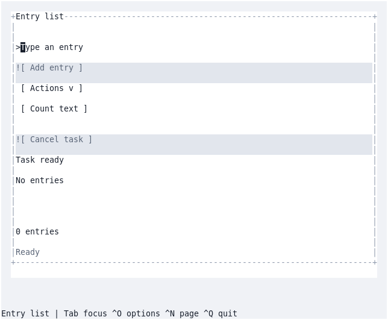

# Software Foundation

A generic reference repository for developing, testing, maintaining and delivering
software. The application is deliberately domain-neutral: an owning, bounded record
collection, a command-line application, and an optional shared GUI application.
The engineering mechanisms are comprehensive: application size does not reduce
coordination, supply, recovery or qualification requirements. C++20 and CMake make the build and binary compatibility examples concrete;
the ownership, testing, documentation and delivery rules apply across languages.
The default implementation is C++; an optional Rust component implements the same
private text-validation contract for the CLI and shared GUI.

## One application, seven backends

Each host presents the same shared **Entry list** application. The six graphical
captures show the 2026-10-02 source snapshot; the TUI uses the corrected
2026-10-04 local capture. Select an image to view it at full size.

| FLTK native window | Rev native window |
| --- | --- |
| [](docs/screenshots/fltk.png) | [](docs/screenshots/rev.png) |
| **SDL window** | **Framebuffer** |
| [](docs/screenshots/sdl.png) | [](docs/screenshots/framebuffer.png) |
| **Hosted browser** | **Browser Wasm** |
| [](docs/screenshots/hosted-web.png) | [](docs/screenshots/wasm.png) |

**Terminal UI**

[](docs/terminal-caret/terminal.png)

[Capture details and provenance](docs/screenshots.md#view-screenshots) identify
the exact source and image bytes. [SCREENSHOTS](SCREENSHOTS) points to the
capture job and refresh instructions. All images are included in the checkout.

Start with the [engineering contract](docs/engineering-contract.md),
[requirements and practice map](docs/requirements.md), [repository map](docs/architecture.md),
and [documentation index](docs/README.md). Contributors and automated assistants
read [AGENTS.md](AGENTS.md) before editing shared resources.

For focused development, automatic compile limits and efficient release qualification,
see [development speed](docs/development-speed.md).

## Run the example

Requires Git, CMake 3.24+, Ninja, a C++20 compiler, and Python 3.9+ for tooling/tests.
On Windows, use a developer command prompt with MSVC and run the Python entry
point shown below. Configuring the project never downloads dependencies.

```sh
./build.sh
./build/dev/foundation-cli -- "First entry" "Second entry"
./build.sh test dev --label core
./build.sh test release --full
./build.sh package release
```

```powershell
python tools/build.py test release --full
python tools/build.py package release
```

The library installs as CMake package `Foundation`, target `foundation::core`.
[The external consumer](examples/consumer/CMakeLists.txt) demonstrates finding it
after installation. [COMPILE](COMPILE) is the short command reference;
[building](docs/building.md) explains configuration, concurrency and SDK use.

Select the Rust validation provider explicitly with a verified retained extension:

```sh
./build.sh test dev --core-provider rust --rust-sdk /absolute/path/to/rust-sdk --label core
```

[Rust provider commands](docs/building.md#optional-rust-validation-provider) and
[SDK preparation](docs/sdk.md#optional-retained-rust-extension) describe the pinned
Rust 1.63, dependency-free `no_std` component. C++ builds do not discover Rust or
download its tools. [Platform limits](docs/portability.md#optional-rust-provider-boundary)
and [the implementation record](docs/rust-hybrid-plan.md) separate working code
from observed qualification.

## Run the GUI

On a Linux desktop, install the native build prerequisites above plus
the FLTK development package (`libfltk1.3-dev` on Debian 12). From the repository
root, build and open the application:

```sh
./build.sh build dev --gui --gui-backends fltk --build-dir build/demo-fltk
./build/demo-fltk/gui/foundation-gui-fltk
```

The **Entry list** window starts empty. Type text in **New entry**, select
**Add entry**, then try **Count text**. Close the window to exit. Entries are
held in memory; **Actions → Export entries** saves them to a file.

[COMPILE-gui](COMPILE-gui) includes prerequisites and an SDL alternative.
[COMPILE-web](COMPILE-web) builds and launches the browser version using only
the native build prerequisites and a browser; it also documents the optional
prepared-SDK Wasm route. Each recipe uses a separate build directory and the
GUI sources already retained in this checkout.

## What is executable here

| Area | Included example | Qualification boundary |
| --- | --- | --- |
| Application | Library, CLI, validation, owned data, stable IDs | Bounded in-memory record contract with explicit failure guarantees |
| Build | One CMake graph, presets, wrapper, focused prerequisite targets | One build tree per configuration and toolchain |
| Tests | Contract checks, tool regressions, installed consumer, disjoint shards | Full means all tests enabled in that configuration |
| GUI | All seven hosts consume one application widget-definition table; native appearance, browser and Wasm fixtures | [GUI audit](docs/gui-audit.md) records actual coverage and the scoped supplier permissions |
| SDK | Source producer, strict prepared-input archives, source replay, relocation, host/target checks, Windows and browser recipes | Cold Linux SDK production requires the declared Bookworm builder |
| Packages | Native TGZ/ZIP, full member inventory, runtime closure/ABI audits, relocation and external consumer | A native build alone cannot establish an older runtime floor |
| CI | Disjoint scopes, reusable lifecycle workflows, explicit faster pools, draft release transport with no Actions artifact uploads | Exact hosted executions and remaining limits appear in [validation](docs/validation.md) |
| Coordination | Scoped review, guarded saves, descriptor-relative atomic publication, handoffs, lifecycle and concurrency tests | Unsupported filesystem APIs require a qualified adapter or enforced private checkouts |
| Releases | Immutable complete groups, mandatory per-release copies, offline recovery and exact-byte certification | Publication, certification attachment and promotion are explicit protected operations |
| Distribution | Debian, Arch and Gentoo wrapping, signed indexes, payload verification, atomic update/rollback checks | Disposable native APT, pacman and Portage checks; initial installation and true version upgrades have separate qualification evidence |

The [Latest entry point](docs/latest-release.md) composes the prepared-SDK release
lifecycle, and the [screenshot workflow](docs/screenshots.md) captures all seven
actual GUI hosts in the same initial state. The [signed package workflow](docs/distribution-release.md)
retains certified inputs and exposes immutable APT, Arch and Gentoo channels.
Each has explicit publication gates.

Large CI outputs use verified private draft release bundles; routine PR feedback
uses bounded logs. Compiler SDKs contain build inputs, while installed browsers,
display services and drivers remain explicit host prerequisites. Routine builds
consume prepared groups and binary releases carry exact copies for recovery.

[Validation](docs/validation.md) records what has actually run and what remains
unverified. Planned platforms and release gates are requirements, not claimed passes.

The [practice map](docs/practice-map.json) provides requirement-to-implementation-to-test
navigation. It is checked for missing references, and does not substitute for the
[actual validation record](docs/validation.md).

## Use this as a project specification

1. Adopt the repository map and replace the small application with your own.
2. Define supported environments and observable compatibility contracts before
   adding implementation. Keep interfaces independent of delivery mechanisms.
3. Fill dependency records, SDK recipes and release inventories with real pinned
   inputs. Do not carry example placeholders into published metadata.
4. Keep the short development loop and full qualification as explicit separate
   scopes. Preserve failures and omissions when reporting evidence.
5. Reuse the [GUI boundary](docs/gui-boundary.md) and the
   [shared-workspace protocol](docs/agent-coordination.md) when applicable.

The code and documentation authored in this repository use the [MIT license](LICENSE).
External dependencies retain their own terms; the [inventory](third_party/README.md)
records the GUI dependency's CC0 dedication and separate supplier terms. The
recorded Rev permission covers this repository; downstream projects must establish
their own applicable supplier permissions.
