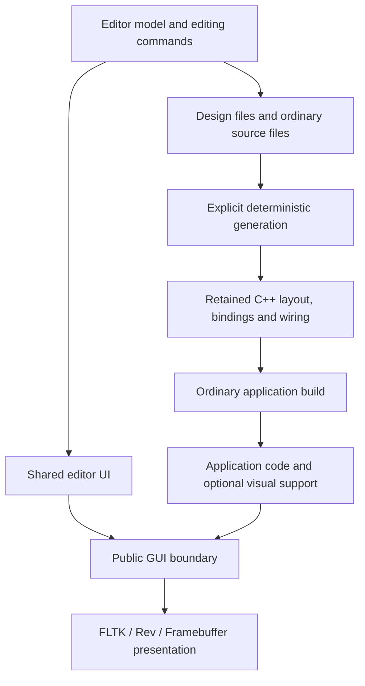

# Optional graphical editor — architecture and implementation plan

Status: first implementation, 2026-10-05. See [the editor guide](README.md) for
implemented commands, editing and source integration, and
[pending qualification](../.agent-pending/editor-platform-qualification.md) for
execution limits. The following architecture plan retains its original design
decisions; proposed extensions are not additional implementation/support claims.
Initial repository inspection used `45a1aa7993214d407f7f1775a1ad3d3e825856e1`.

Build a small, optional native authoring application with two visual workspaces:
**Forms** for GUI layout and event bindings, and **Flows** for stream processing.
Double-click opens a code window editing an ordinary source file. C++, Rust,
headers, modules, libraries and the project's compiler tools remain the place
for complex behavior. The editor supplies convenient composition and navigation.

The editor runs through **FLTK, Rev and the software framebuffer renderer with
the existing SDL display/input host**. SDL presentation was explicitly selected.
The later scope clarification excludes editor TUI, hosted browser and Wasm
hosts. This does not remove any backend from the example application or prevent
an authored application from targeting those backends.

The editor itself is **C++20 by default**. Rust is not an editor build dependency
unless a later, concrete implementation benefit justifies using it. Supporting
ordinary C++ GUI files and C++ calls into Rust is sufficient for the initial
language integration; Rust files can also be edited as ordinary text.

## 1. Decisions that keep the scope small

| Question | Recommended decision |
| --- | --- |
| Relationship to the example | A separate `EditorApplication`, outside the Entry-list application and `foundation::core`. |
| GUI implementation | The existing public GUI boundary, widgets, text editing, bitmap surface and generic host services. No toolkit-specific feature logic. |
| Language support | Edit complete ordinary files; compile normal callbacks/factories. No interpreter, compiler frontend, reflection engine or dynamic plugin loader. |
| Designer output | Small, deterministic, retained C++ layout/binding/wiring files; handwritten C++ and Rust remain independently editable. |
| Block implementation | A thin typed adapter around any suitable existing function/object, or a newly created ordinary source file. |
| Stream execution | A small optional runtime with bounded queues and one native worker by default; project-owned executors remain possible. |
| Build | An explicit editor command, separate CMake source directory and build tree; no editor target in the ordinary application graph. |
| Dependencies | C++20 standard library, existing GUI inputs and selected existing toolkit; reuse existing Python/CMake/Ninja build tools. No new SDK package. |
| Distribution | Build locally from source with the existing SDK or supported installed tools. No editor binary release, package channel, certification pipeline or retained build artifacts. |
| Self-hosting | The editor's own forms, actions and an example flow use the same authoring format and ordinary source bindings; retained generated files permit bootstrap without an editor binary. |

No docking system, debugger, package manager, language server, visual algorithm
language, embedded terminal, automatic dependency download, mandatory database,
or third-party extension marketplace belongs in the first implementation.

## 2. Existing foundations and actual gaps

The [GUI integration contract](../docs/gui-boundary.md) already separates shared
application meaning from rendering. The
[view table](../gui/shared/view_definition.hpp) demonstrates one declaration
for widget identity, ordering and layout. The editor should follow that pattern
without making the example depend on editor declarations.

The retained GUI contract supplies `group`, `label`, `button`, `toggle`, `choice`,
`text`, `list`, `bitmap` and `menu`. Text supports multiline input, selection,
clipboard and explicit focus. Pages, modal groups, scrollable groups, text
measurement, bitmap actions and raw pointer events are already available.
The [touch contract patch](../gui/patches/touch-contract.patch) adds captured
press/move/release/cancel phases. A new canvas widget or code-editor toolkit is
unnecessary. Verify the selected adapters' behavior in the actual editor before
claiming completion; an API declaration alone is not user-facing qualification.

The [generic host contract](../gui/host/contract.hpp) already parameterizes the
application type. Small editor composition roots can instantiate that contract.
Some reusable runner functions currently reside beside example-specific `main`
functions; extract only the generic functions needed for reuse, preserving their
behavior and leaving the example's composition roots in place.

Three gaps require deliberate work:

1. **Project files and builds.** Existing
   [file services](../gui/host/file_services.hpp) move bounded text through dialogs
   and cap a transfer at 64 KiB. They are not a multi-file workspace API. Add
   editor-private `ProjectFiles` and `ProcessRunner` interfaces with native
   implementations. Keep filesystem paths and processes out of GUI adapters.
2. **Interactive framebuffer presentation.** The current
   [framebuffer command](../gui/hosts/framebuffer_main.cpp) writes a PPM and exits.
   The [embedding interface](../gui/host/framebuffer.hpp) accepts input and
   presents frames, but no direct fbdev/DRM device driver is provided. Use the
   existing SDL display/input host for the framebuffer renderer as the selected
   desktop route. SDL is existing optional host machinery, not an additional
   editor widget toolkit. A direct
   device route would need a small generic driver with display, pointer, keyboard,
   resize and shutdown handling, and separate device validation; it is outside
   the initial editor scope.
3. **Build isolation.** The existing GUI CMake file also creates example targets,
   tests and installation rules. Reuse its dependency setup through a small
   helper; do not add the entire example GUI subdirectory to the editor build.

No change to the public widget vocabulary is initially necessary. Add a generic
GUI capability only after a concrete interaction proves it necessary, and keep
its contract and applicable adapter checks together.

## 3. Interface and normal editing workflow

One main window has a small command row, a project list, the current workspace,
and a properties panel. Diagnostics appear in a collapsible bottom region.
Avoid configurable docking and permanent tool windows.

```text
 Project  Save  Undo  Redo                    Preview  Build  Run/Stop
 -------------------------------------------------------------------
 Forms / Flows / Files  | Forms: Main panel       | Properties
                       |                        | Name / label
 Main panel            | [device choice       v]| Layout
 Receive chain         | [Start] [Stop]          | Events
 handlers.cpp          | [status text          ] | [Edit code]
 receiver.rs           |                        |
 -------------------------------------------------------------------
 Diagnostics: file:line, message                  Saved / Modified
```

The center switches between a form canvas, flow canvas and source file. A code
window opened by double-click uses the existing modal-group mechanism: a large
in-window dialog with file name, event/method selector, multiline text area,
Save, Cancel and Open externally. This satisfies the code-window interaction on
all three renderers without requiring a new native multiple-window API. It edits
the complete file and places the selection at the relevant function anchor.
Cancel discards that window's unsaved buffer after the usual dirty-buffer choice;
it does not reverse already saved files.

**Forms workflow:** choose a widget from the short palette, place it, edit its
label/options/layout, then double-click to open its default event. An Events
list exposes other supported events and allows multiple controls to use the
same handler. Disabled controls remain selectable in design mode. Design clicks
select controls; they never execute the application's handlers.

Use parent groups, rows/columns, margins, stretch and minimum sizes as the default
layout model. Dragging changes order, grouping or size constraints; it does not
quietly turn a responsive form into a set of fixed pixels. Offer explicit
absolute placement inside a group for device panels and other justified cases.
Positions use logical units and layout uses the boundary's text measurements.
Minimum sizes are small editor-owned/generated clamping rules around the existing
layout primitives, not a new constraint solver or an existing min/max API claim.
The preview renders actual public widgets for the chosen backend and window
size. Schematic design rendering need not imitate every native control exactly.

**Flows workflow:** choose a block, place it, connect named output and input
ports, and set a few parameters. Display port type and direction beside each
port. Ports can be selected in an ordinary list, which remains usable when a
block has many ports. Click source then destination is an alternative to dragging
a wire. Double-click opens the block's Work method; the method selector also
offers Setup, Reset/Stop and the factory when supplied.

Simple commands cover select, move, resize, connect, disconnect, duplicate,
delete, pan, zoom, undo and redo. Unconnected required ports and incompatible
types are marked beside the affected object and in diagnostics. Deleting a
widget/block removes its design references and wires, with undo, but never
silently deletes handwritten source files.

The source editor needs reliable UTF-8 editing, selection, clipboard, undo,
find and save. Syntax coloring and completion are optional later conveniences.
Preserve Unicode source bytes even when a renderer cannot display every glyph.
The existing framebuffer font covers ASCII and Latin-1 with replacement glyphs
outside that set; disclose that display limit and retain Open externally without
adding a required font package.
Show a path and binding identifier even when a source anchor no longer exists;
open the whole file and allow explicit rebinding. Never guess a new handler
based on a stale line number or perform automatic source-wide renames.

On a small screen, properties replace the project list temporarily; the code
window fills the client area. All operations have named actions and keyboard
access. Pointer gestures improve speed but are not the only way to operate.

Preview is an inert layout preview using sample values. Run invokes an explicitly
configured application build/run recipe in a separate process. Neither opening
a project, selecting a block, nor Preview loads or executes project code.

## 4. Files, ownership and generation

Use a versioned, readable JSON design format. It describes composition, never
embedded code strings. A single semantic design document contains forms, widget
identities, event binding references, blocks, ports, parameters and edges. A
separate optional view file contains flow-node positions, zoom and collapsed
panels. Losing view state cannot change the compiled program. Form constraints
belong to semantic data because they affect the running GUI.

An adopted project could contain the following. These are proposed paths, not
files introduced by this planning change:

```text
 design/project.json          # design schema version, forms, flows, bindings
 design/view.json             # optional authoring positions and preferences
 design/catalog/*.json        # descriptions of this project's block wrappers
 generated/visual/*.hpp       # stable widget/port IDs and typed declarations
 generated/visual/*.cpp       # layout, event dispatch and flow composition
 src/ui/handlers.cpp          # user-owned event functions and ordinary helpers
 src/blocks/receiver.cpp      # user-owned C++ block wrapper or implementation
 rust/receiver/src/lib.rs     # user-owned Rust implementation
 src/composition.cpp          # application-owned services, lifetimes and startup
```

Stable object IDs are independent of display names. Bindings identify an existing
source path, a user-facing symbol name and a stable adapter ID. An optional
lightweight comment anchor helps navigation; it has no execution semantics.
Several block instances share one implementation while retaining distinct state.
Renaming a block instance does not rename a C++ class or Rust function.

Every content class has one owner:

| Content | Authority and editing rule |
| --- | --- |
| Form structure, bindings, graph connections | Design document; editable in the graphical editor or as text. |
| Function bodies, helper functions, types, algorithms, build files | Ordinary user-owned source; edited here or in any external editor. |
| Generated layout/dispatch/composition | Deterministic output; do not merge handwritten logic into generated files. |
| Block descriptions | Small declarative catalog referring to ordinary typed wrappers; compiler checks the wrapper contract. |
| Application runtime state | Application-owned objects; never serialized implicitly into the design document. |

Existing GUI C++ files, including handwritten view tables and event logic, remain
ordinary editable files. Adopting the graphical designer is explicit and can be
limited to one form or flow; there is no automatic reverse engineering of
arbitrary C++ layout code. Generated and handwritten forms/blocks can coexist
under an application-owned composition root with checked, distinct identities.
Support forms without flows, headless flows without GUI runtime dependencies,
multiple form/flow instances, and code-owned blocks absent from the visual
catalog. A visual graph is one way to construct the runtime, not its only API.

New-handler and new-block actions create an ordinary file once, show it immediately,
and bind to it. Do not rewrite user-owned declarations on every save. Existing
functions with arbitrary signatures are used through small explicit adapters;
no general C++/Rust parsing is required. The compiler and linker diagnose missing
symbols, type mismatch, template errors and unsupported target code.

Saving a valid semantic edit also prepares its generated output. Generate
deterministically, omit timestamps, use stable ordering and replace only changed
files. Navigation, graph positions and pane sizes must not rewrite generated
application files. Keep generated output in source control, so a normal build,
CI job, source recovery and the initial editor build do not need a running editor
or a newly built generator. A small headless `generate`/`check-generated` entry
shares the editor's model and emitter for explicit authoring operations; it is
not an application build prerequisite.

The cost of this choice is explicit: editing the semantic JSON in an external
editor requires an explicit generation step before building the changed design.
The application compiler consumes the retained generated source. The IDE's Build
and Run actions refuse an out-of-date design/output pair and offer generation;
ordinary source-only builds continue to compile those retained files. Document
this next to an adopted project's design file rather than silently adding an
editor invocation to every application build. An adopting project may choose
its own inexpensive freshness check, but the example does not acquire one.

The generator emits normal includes and calls with source comments linking back
to design object IDs. It neither packages dependencies nor changes compiler,
Cargo, CMake or linker policy. No GUI or graph metadata is required at application
runtime if the generated composition is compiled in.

## 5. Events, GUI helpers and application code

Generate thin event dispatch using stable widget IDs and documented event
payloads. A handler adapter receives a typed event, application services and a
small `Ui` facade. It can call any ordinarily linked C++ function, including a
Rust shim, receive results and update the GUI. The adapter convention does not
restrict the signatures of functions called beneath it.

The `Ui` facade acts on an application-owned GUI model, not native widgets.
It exposes the useful existing vocabulary: text, choice options and selection,
enabled/visible state, checked state, list contents, focus and layout invalidation.
Use typed handles or generated constants, validate kind/generation, and return
an explicit failure for a stale or incompatible handle. Batch updates into one
model change and presentation request; changing choice contents defines whether
the old stable selected option is retained or selection becomes empty.

Illustrative C++ API shape, to be finalized during implementation:

```cpp
void set_busy(Ui& ui, bool busy) {
    ui.set_enabled(ids::start, !busy);
    ui.set_enabled(ids::stop, busy);
}

void on_refresh(AppServices& app, Ui& ui, const ActivateEvent&) {
    const auto choices = app.devices.cached_choices();
    ui.replace_options(ids::device, choices, SelectionPolicy::keep_if_present);
    ui.set_text(ids::status, "Device choices updated");
}

void on_start(AppServices& app, Ui& ui, const ActivateEvent&) {
    set_busy(ui, true);
    const auto result = app.processing.request_start(ui.selected(ids::device));
    if (!result.accepted()) {
        set_busy(ui, false);
        ui.set_text(ids::status, result.message());
    }
}
```

`set_busy` may live in any ordinary helper file and be called several levels
below a handler. The facade/context is passed explicitly; avoid a process-global
current window so multiple application instances remain possible. A handler may
also return domain results from its helper calls and translate them into GUI
updates in the caller. No language bridge tries to infer those results.

All direct GUI model changes occur on its owner thread. Workers receive owned
input snapshots or explicitly owned services and a `UiPost` mailbox for typed,
owned commands/results. They never retain a native widget, adapter or borrowed
`Ui&`. Posted commands carry a view/request generation; close, replacement and
cancellation reject late updates. A bounded mailbox coalesces expendable progress
but must acknowledge or explicitly reject required completion/control transitions.

Dispatch is ordered and non-reentrant. Programmatic changes do not synthesize
user-change events unless an explicit application action requests that behavior.
Disabled controls reject stale user events; application code can still update
their content. Work that can block goes to an owned worker/service. Handle errors
by restoring controls from authoritative application state, including failed start,
completion, cancellation and stop. GUI lockout is a usability policy, not a
substitute for validating operations in the application service itself.

## 6. Blocks, arbitrary functions and MIMO streams

A block is a stateful object created by a project-owned factory. Its Work adapter
can call ordinary free functions, methods, function objects, templates,
callbacks or Rust functions. Pass service references and owned objects through
the composition root and factory, not through serialized memory addresses.
Share objects only with a defined ownership and synchronization contract; destroy
workers and blocks before the services they borrow.

The graphical layer understands the wrapper's ports and parameters, not the
algorithm. A project can expose a complicated library through a small wrapper
and a short catalog entry. The catalog is static data; loading it never loads a
shared library or runs a factory. Generated code verifies the declared port
types against the wrapper's compiled contract. Custom visual appearances are
unnecessary: a labeled rectangle with named ports is sufficient.

**MIMO is a first-class contract:** each instance has independently described
input and output port lists, including zero inputs for sources and zero outputs
for sinks. Each list may have any finite configured length within the project's
explicit resource limits. There is no one-input/one-output restriction, equal
arity requirement, equal stream type requirement or equal rate assumption.

Use stable port IDs, direction, type identity and optional/required status. Permit
repeated port groups, such as an N-channel receiver, resolved and validated at
graph construction. Changing arity while running requires stop/reconstruction;
runtime self-modifying port sets are outside the initial contract.

Each Work call receives independently sized readable spans and output capacity
for each port (writable spans for simple numeric types, typed writer leases for
nontrivial objects). It returns **consumed counts per input**, **produced counts per
output**, and a status such as progress, waiting, finished or error. A source
consumes nothing; a sink produces nothing. A resampler can consume and produce
unequal counts; different outputs may produce different counts. Counts must fit
their offered spans and be validated before committing queue indices.

```text
 three inputs:  i0: complex<float>, i1: complex<float>, control: Command
 one Work call: consumed = [256, 128, 1]
 four outputs: audio: float, symbols: Symbol, metrics: Metric, trace: Record
 same call:     produced = [192, 64, 1, 0]
```

This example is intentionally not representable by a single common output count.
A simpler synchronous adapter may derive equal counts for the common case, but
must be implemented on top of the general contract.

Stream elements may be scalars, complex samples, fixed vectors, frames, records
or owned object handles. C++ stream storage uses the actual type's construction,
move and destruction operations and alignment; arbitrary objects are not raw
byte arrays. Borrowed spans are valid only for the Work call. Retaining samples
requires owning a copy/move or a separately documented retained-buffer interface.
For nontrivial types, output leases construct items explicitly and track which
items exist; the produced count must match committed constructed items. Move-only
inputs use an explicit `take_next` lease that records transferred ownership and
requires the returned consumed prefix to cover every taken item. A failed call
tears down the graph with each remaining/staged object destroyed exactly once;
it does not promise rollback of moved objects or arbitrary user side effects.
Cross-process/network serialization is explicit project code, not implied by
connecting two ports.

For the first runtime, one edge has one producer and one consumer. Explicit
Split/Broadcast blocks handle fan-out and define copy/shared-immutable ownership
and slow-consumer behavior. Explicit Merge/Select blocks define ordering and
arbitration for fan-in. The UI may insert a visible split after a user chooses
its policy; it must not duplicate a move-only object or choose a merge order
implicitly. Type conversion likewise uses an explicit adapter block.

Stream data and infrequent control/events are distinct concepts. Use a bounded
command endpoint for parameter changes, status, triggers and GUI interactions;
do not poll arbitrary GUI widgets from a signal-processing loop. Both APIs are
ordinary code interfaces available without the editor. Timestamped samples,
sample-indexed tags and packet metadata can be explicit user types initially;
automatic time/rate alignment is not promised. External DSP frameworks can own
execution behind a wrapper or a project-supplied graph executor.

## 7. Runtime scheduling and lifecycle

Keep execution independent of the editor model and GUI. The optional runtime
contains graph validation, typed bounded edge storage, block lifecycle and a
small scheduler. It contains no block catalog browser, document parser, source
editor or build tools. An application links only the parts it adopts.

Start with one owned worker per graph and serialized Work calls in a fair ready
queue. Allocate buffers during setup, bound work per scheduling turn, and avoid
allocations in the steady-state numeric processing path. Queue capacity is in
items and bytes; validate multiplication, total memory, alignment and any minimum
batch/contiguous-span requirements before starting. A wrapper with stricter
batch needs declares them, allowing validation of the chosen buffer sizes.

| Situation | Required behavior |
| --- | --- |
| Output queue full | Apply backpressure; never overwrite unread items. A drop policy requires an explicit block/edge option and visible counters. |
| Input temporarily empty | Wait for a dependency; do not report end of stream. |
| No progress | A waiting result names an input/output/timer/external wake condition. Avoid a busy loop. A stalled closed graph reports the blocking ports. |
| Feedback loop | Require an explicit initialized delay/state element that can make initial progress; also validate buffer/batch compatibility. A seeded cycle alone is not proof against all deadlock. |
| End of stream | Each output can close independently after publishing its final items; consumers distinguish drained/closed inputs from temporarily empty inputs. |
| Unequal input lengths | The block declares its policy: finish when a required input ends, pad, drain others, or report an error. Never guess. |
| Consumer finishes early | Close its remaining input subscriptions and explicitly discard unread items on those edges. Notify producers, including a split's per-output policy, so abandoned edges cannot leave producers blocked forever. |
| Block exception/error | Fail and quiesce the entire graph by default, invalidate its generation, and record block/port context. Translate errors at the runtime boundary. |
| Live parameter change | Apply a typed command between Work calls, acknowledge acceptance/rejection and attach the graph generation. |
| Topology/type/arity change | Stop, finish worker ownership, rebuild the graph and restart explicitly. No live code swapping. |
| Stop | Request cooperative cancellation, wake waits, stop sources, discard queued data by the documented default, join owned work, then report stopped. Offer drain only as an explicit policy. |

Use `stopped -> starting -> running -> stopping -> stopped`, plus
`running -> completed` for natural completion and a visible `failed` state
carrying the cause. Completed/failed graphs can be reset for an explicit new
start. Setup is failure-atomic: destroy already-created
blocks in reverse ownership order if a later factory fails. Starting, stopped
and completed notifications are reliable state transitions, not droppable
progress samples. At-most-one invocation per block is the default; parallel or
device executors require their own explicit ownership contract.
Natural completion occurs when sinks are terminal, all channels are drained or
explicitly discarded/closed, and remaining producers have quiesced. It differs
from user-requested stop and from failure. Input cancellation propagates upstream;
a producer whose consumers have all closed must finish or receive cancellation.

Ordinary C++/Rust code cannot be forcibly interrupted safely. Blocks must return
within their declared work bound and device calls must be cancellable or owned by
a suitable separate executor. A noncooperative call keeps stop pending; the
runtime must not detach the worker and free its state. Running an authored
application in a child process permits an explicit process termination option,
but it does not make in-process DSP calls safely cancellable. This is not a hard
real-time/audio-latency guarantee. Projects requiring that capability retain
their existing specialized scheduling underneath the wrapper.

## 8. C++ and Rust interoperability

C++ wrappers can use ordinary C++ object types within a compatible compiled
program. The current [Rust component](../docs/rust-hybrid-plan.md) demonstrates
a narrower contract: Rust 1.63, `no_std`, no third-party crates, and a private C
ABI for bounded validation. It is not a general Rust object interoperability
layer and should not be expanded to serve editor reflection.

Provide small optional examples of both directions: a C++ block/handler calling
Rust through `extern "C"`, and Rust calling a host callback table with a context
handle. Use fixed-width scalars, length-delimited buffers and opaque owned handles.
Document create/destroy pairing, allocator ownership, thread affinity, callback
lifetime, aliasing, alignment and error status. Keep C++ exceptions and Rust
panics from unwinding across the boundary. A component using abort-on-panic must
state that process-level behavior rather than promise recovery.

Do not pass `std::string`, C++ templates, Rust trait objects, references with
unproven lifetimes or language-native closures directly across the ABI. Arbitrary
domain objects remain available through ordinary same-language calls or explicit
opaque-handle adapters. Extra crates, generators or native libraries are optional
project dependencies subject to that project's retained-input policy; none
becomes an editor or SDK prerequisite. Target-unavailable APIs produce a normal
build error or declared capability error, not a portability promise from the GUI.

## 9. Module boundaries and self-hosting

Proposed organization, keeping the current example intact:

```text
 editor/
   PLAN.md
   CMakeLists.txt              # standalone opt-in build graph
   model/                     # documents, validation, edit commands, undo
   ui/                        # EditorApplication and shared layout/interaction
   code/                      # text buffers and binding navigation
   generate/                  # deterministic emitters and headless authoring CLI
   platform/                  # ProjectFiles, ProcessRunner implementations
   hosts/                     # thin FLTK/Rev/framebuffer-with-SDL roots
   self/                      # editor's own design and retained generated output
   tests/                     # explicit local editor tests, outside app discovery
 visual/                      # optional reusable application-side support
   ui/                        # typed model facade and event binding helpers
   flow/                      # stream contracts, queues, default executor
   examples/                  # small C++ and Rust wrappers, separately selected
 gui/host/                    # existing generic host interfaces, reused
 gui/shared/                  # existing Entry-list feature code, unchanged
```



Application-side `visual/` support must remain outside the editor-only CI
exclusion: once an application adopts it, it is application runtime source.
Existing projects can ignore the entire facility. Adoption links a small explicit
module and generated sources into the project's current composition root;
there is no editor service or document runtime in a shipped application.

The editor's own form definitions and event bindings live in `editor/self/`.
Retained generated sources bootstrap it with the normal compiler. Once built,
the editor can open its own project, change a toolbar label or action binding,
save, rebuild into its separate tree and run the new executable. It need not
replace the currently running executable or hot-load code. Its own models,
emitters, file code and algorithms remain ordinary handwritten code.

Include a small self-hosted flow example, such as a finite sample source through
a transform into a bitmap display, using the same block workflow. Do not force
the editor's UI event loop, file saves or compilation through a DSP graph merely
to make self-hosting look more complete.

## 10. Offline build, SDK, CI and release isolation

Introduce an explicit `editor` operation at the existing build entry point,
dispatching before application-provider/package logic. It configures
`editor/CMakeLists.txt`, uses a distinct output directory, and creates only editor
targets and selected GUI prerequisites. Ordinary `build`, `test`, `package`,
SDK maintenance, release and qualification operations retain their present
meaning. Merely passing `--gui` never enables the editor.

Reuse verified GUI-source restoration, compiler/toolchain selection, existing
SDK environment checks and runtime staging through narrow shared helpers. The
current [GUI CMake integration](../gui/CMakeLists.txt) links host executables to
the example application and adds install rules; that whole file is not a reusable
editor dependency. Do not duplicate toolkit recipes or bypass locked GUI inputs
to avoid this separation work.

Resolve shared helpers and dependency inventories from explicit repository/module
roots: existing policy code uses `CMAKE_SOURCE_DIR` for some paths, which would
otherwise resolve incorrectly inside the standalone `editor/` project. Keep
these shared helpers outside the editor-only CI exclusion. Give editor build trees
their own stamped identity covering component/operation, backend, toolchain,
SDK/source-group identity and configuration; reject reuse of an application tree
or an incompatible editor tree before configuration.

The initial editor is C++20 throughout and need not link Store or its Rust
validator. Editing Rust text does not require embedding Rust in the editor.
Building an authored Rust application still uses its existing Rust toolchain and
retained extension. If the editor itself later contains Rust code, it must use
the same existing matching extension and offline rules, with no new crates.

For FLTK, preserve the installed Bookworm-era distribution route. Rev already
requires a newer retained compiler/module toolchain; use the existing matching
SDK rather than claim stock Bookworm tools can build Rev. The framebuffer route
uses the existing renderer and chosen presentation host. No normal editor build
fetches inputs, installs packages, contacts a registry or mutates the SDK. SDKs
remain shared read-only inputs; build products and caches stay in the editor's
own output tree. Missing prerequisites fail with concise instructions.

The initial implementation must establish these exclusions:

- No editor executable, generator, tests or dependency probes in the default
  application target graph, CTest inventory or installation graph.
- No editor target in application package exports, notices/runtime closure,
  signed channels, screenshot jobs, release inventories or certification gates.
- No editor CI workflow or editor binary artifact upload/retention policy.
  Editor checks are local and explicit, and do not gate application jobs.
- No second SDK flavor, recipe, binary/source group, package or cache service.
- Editor-only source changes must not select application compile/GUI jobs through
  the conservative [CI change selector](../tools/ci_changes.py). Add one reviewed,
  narrow editor-only path classification during implementation. Unknown paths,
  shared GUI/build changes, application generated code and adopted `visual/`
  runtime changes remain application changes.
- Editor tests live under `editor/tests/`, outside the application's root test
  discovery. Shared contract changes retain the application's applicable checks;
  calling them editor work cannot waive application correctness.

There is one unavoidable limit to an absolute zero-cost reading of the request.
The existing [source identity mechanism](../tools/source_identity.py) inventories
the complete source tree, and root CMake watches that inventory. New tracked
editor source adds its small byte/hash/archive cost, changes complete source
identity and can trigger application CMake reconfiguration. Preserve this
provenance guarantee; do not silently omit editor files or relabel old exact-source
evidence. No extra binary artifact, build matrix or release gate is needed.
Strictly zero additional source bytes or source-identity work would require
changing the established complete-source policy or separating the repository;
neither is recommended for this editor. Keep editor sources small and generated
build artifacts ignored. There is no new need to store editor binaries.

## 11. Brief build-and-run entry point

Add root `COMPILE-editor` with the first working editor implementation. It must
be a short operational file, analogous to `COMPILE-gui`, with one known-working
compile command and one run command, prerequisites, and a link for backend/SDK
variants. Keep these proposed commands inside this plan until implemented and
locally verified; a nonexistent binary must not be advertised as runnable.

Intended default recipe, subject to the final CLI implementation:

```text
Software Foundation — build and open the optional editor

From the repository root, with existing native build tools and FLTK development
packages already installed. Normal builds do not download anything.

./build.sh editor build dev --backend fltk --build-dir build/editor-fltk
./build/editor-fltk/foundation-editor-fltk --project /path/to/project

Repeat the build command after source changes. The editor uses a separate build
tree. Application build, test and release commands remain independent.
Other backends and the existing SDK route: editor/README.md.
```

The eventual detailed guide supplies the matching `--sdk PATH` recipe, Rev and
interactive framebuffer variants, and Windows commands only when those native
paths have actually been exercised. The C++ SDK route must not demand a Rust
extension just to edit Rust files or create a C++ wrapper for Rust. The detailed
guide names SDL2 as the existing framebuffer presentation prerequisite. Native
runtime/display prerequisites remain explicit; having compiler inputs is not a
promise of a connected display/device.

## 12. Save, conflict and failure behavior

The editor is a regular file editor in a shared codebase. Record original bytes
and identity when opening a file; before save, detect changes made by an external
editor. Offer reload, save-as or a small conflict view rather than overwriting
new bytes. Preserve encoding/line-ending policy and reject invalid UTF-8 without
destructive conversion. Large files beyond the configured editing limit remain
available through Open externally; the graph binding need not be removed.

Use bounded parsing, schema versions, duplicate-key rejection and explicit
diagnostics. Initial configurable bounds should cover file bytes, total open
buffers, widgets, blocks, ports, nesting, edges, undo memory and generated output.
Set useful conservative defaults during the first fixtures, including at least
ordinary multi-megabyte native source files; do not inherit the 64 KiB dialog
transfer limit as the project model. A small editor-private JSON codec can use
only the standard library; do not depend on a backend's private web parser.

Save individual files by checked replacement and preserve unsaved buffers after
an error. For semantic design plus generated output, stage all output first and
use a small recoverable save journal recording old/new hashes and publication
progress. Commit the design/output revision marker last. An interrupted batch
is detected on reopen and must be completed or restored before the IDE builds.
Do not claim atomic multi-file visibility to other editors or shell builds:
contributors should not build during publication, and unrelated handwritten
files are never enrolled in automatic regeneration/rollback. The optional view
file is separately saved and has no execution significance.

Workspace paths are rooted explicitly and checked before writing; opening a
project does not authorize arbitrary paths or execution. Use argument arrays,
an explicit working directory and existing process ownership for build/run
recipes. Build/Run are explicit user actions; ordinary project loading performs
no configure hooks. Stop/close cancels owned tasks and handles their children
before releasing resources. A compiler failure keeps source changes and full
bounded diagnostics; a failed build never launches a stale binary as if current.

## 13. Implementation sequence and acceptance criteria

Keep each step independently reviewable. Do not rewrite the example application
as a prerequisite or change the GUI supplier merely to rearrange editor code.

| Step | Deliverable and focused acceptance |
| --- | --- |
| 1. Isolation and host shell | Standalone editor target using public GUI contract; explicit build entry and `COMPILE-editor`; empty window on FLTK/Rev and framebuffer via SDL. Compare default target/test/install inventories, verify editor-only CI selection and reject incompatible/application build trees using stamped identities. |
| 2. Files and minimal code window | Open/save ordinary files, conflict detection, multiline editing, selection navigation, external editing and diagnostics. Exercise non-ASCII text, external modification, read-only/full storage and close with unsaved edits. |
| 3. Forms and events | Palette, layout/property edits, event bindings and deterministic generated C++; double-click creates/opens a handler. A helper changes dropdown choices, text and button lockout through the public model on each selected editor backend. |
| 4. Stream contract and small runtime | Typed MIMO wrappers, bounded queues, one worker and explicit lifecycle. Run source/sink, unequal-rate multiport, backpressure, feedback-delay, EOF, error, cancellation and stale-generation fixtures without GUI. |
| 5. Flow editor and C++/Rust example | Graph editing and compile-time binding validation. A multi-input/four-output block calls existing C++ and a Rust shim; injected state and helper callbacks reach the GUI by owned messages. Build offline with the existing inputs. |
| 6. Self-hosting and adoption | Open the editor's own design, edit/save/rebuild/run; demonstrate adoption into a separate small consumer without modifying the Entry-list application. Retain generated sources and reproduce bootstrap without an editor executable. |

Focused manual/local checks belong to editor development. No phase creates a
mandatory editor CI matrix or application release obligation. Shared helper or
GUI contract changes still receive their proportionate existing application
checks. Extensive qualification remains subject to the repository's existing
manual-qualification policy, without blocking application work on optional editor
qualification.

Completion means the same semantic edit can be performed through all selected
editor hosts, handwritten code survives regeneration, normal application builds
work with the editor absent, and the existing SDK can build the editor offline.
Prove those behaviors locally for the available exact environments and identify
unexecuted platform/device coverage. Do not infer all-host success from one
renderer or merely compiling the shared model.

## 14. Boundaries worth retaining

The most useful first version is a visual composition tool with dependable files
and narrow runtime contracts. General code refactoring, arbitrary live topology
mutation, automatic time synchronization, distributed execution, hot reload,
unbounded file sizes and hard real-time scheduling would make it a substantially
different project. Each can remain in ordinary project code or be added later
through the defined interfaces when an actual use case warrants it.

The familiar interaction precedents are documented in Microsoft's
[event-handler designer workflow](https://learn.microsoft.com/en-us/dotnet/desktop/winforms/controls/how-to-add-an-event-handler)
and GNU Radio's
[block categories and variable-rate processing](https://wiki.gnuradio.org/index.php/Types_of_Blocks).
They inform double-click navigation and explicit stream accounting; neither
Visual Basic/.NET nor GNU Radio is a proposed runtime or build dependency.

See the existing [architecture](../docs/architecture.md),
[offline build contract](../docs/offline-builds.md),
[SDK policy](../docs/sdk.md) and [GUI ownership rules](../docs/gui-boundary.md)
for the invariants this implementation must preserve.
